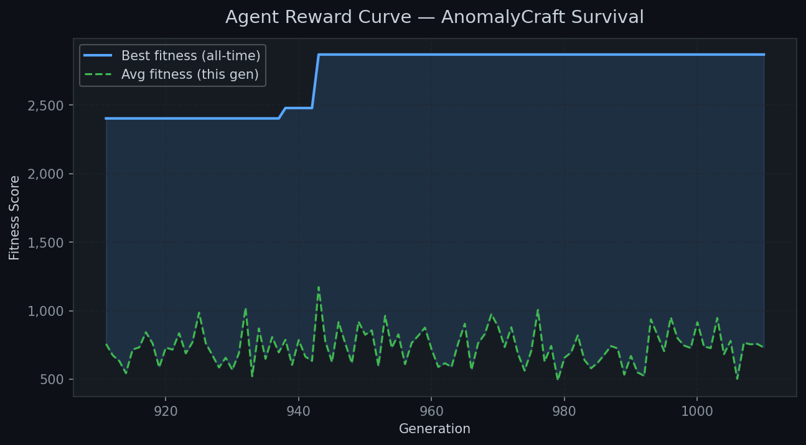
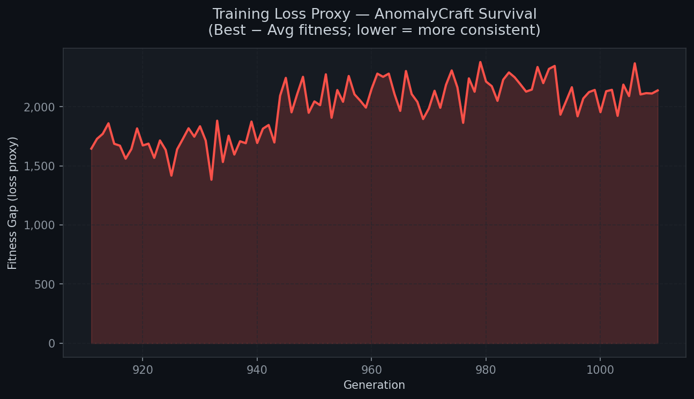
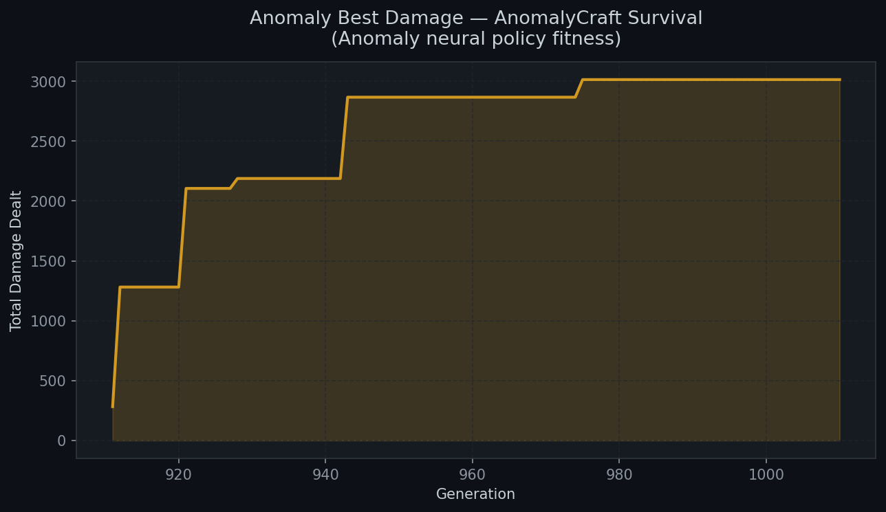
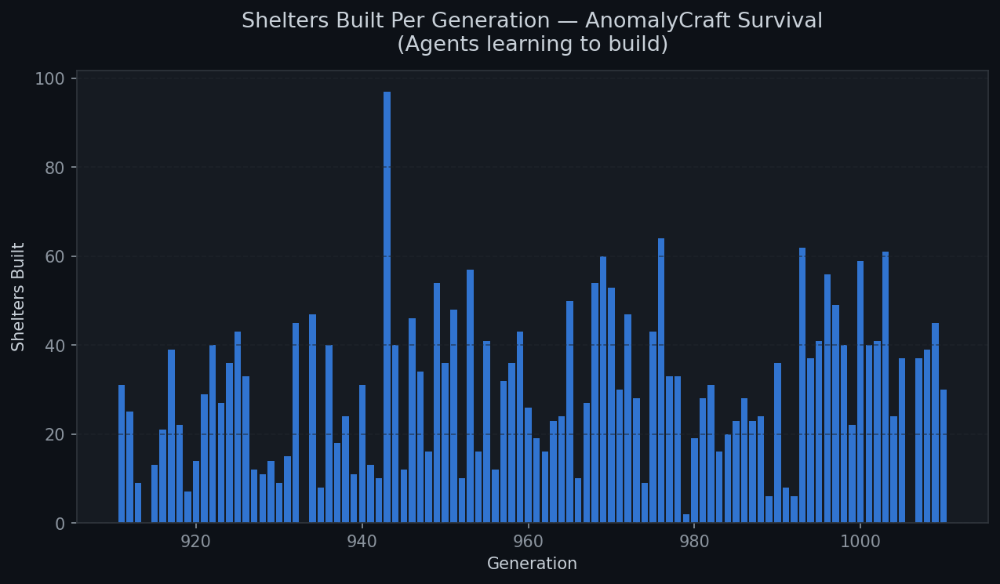

# 🌍 AnomalyCraft Survival

> OpenEnv Hackathon 2026 — Meta × PyTorch × Hugging Face — built in 36 hours

Multi-agent survival environment where AI agents and anomalies both evolve neural network policies through neuroevolution. Fully OpenEnv-compliant with 5 tasks, dense rewards, and a live pixel-art web UI.

## Links

| | |
|---|---|
| 🤗 HF Space | [nimeshyadav/OpenEnv](https://huggingface.co/spaces/nimeshyadav/OpenEnv) |
| 💻 GitHub | [fursatiinsaan/OrgSim](https://github.com/fursatiinsaan/OrgSim) |
| 📖 Dev Blog | [BLOG.md](./BLOG.md) |

---

## What It Does

A 48×48 grid world. Six agents spawn each generation. They gather resources, craft tools, build shelters, form communities, bond with each other, and fight anomalies — all driven by evolving neural networks.

The anomalies also have neural networks. Both sides evolve in parallel. It's an arms race.

When all agents die, the world restarts with a smarter generation that inherits collective memory from the previous one.

---

## 5 Tasks

| ID | Name | Difficulty | Goal |
|---|---|---|---|
| 101 | First Steps | Easy | Gather 5+ resources, survive 30 ticks |
| 102 | Craft and Survive | Medium | Craft 2+ items, 1+ agent alive at 80 ticks |
| 103 | Anomaly Outbreak | Hard | Destroy 1+ anomaly, 2+ agents alive at 120 ticks |
| 104 | Build a Civilization | Expert | Community + 2 buildings + population 8+ |
| 105 | Winter Siege | Nightmare | Survive winter, destroy 3 anomalies, build shelter |

---

## Neural Networks

**Agent policy** — 22 inputs → 16 hidden → 9 outputs (numpy, CPU only)

Inputs: health, energy, hunger, nearby resources, nearby anomalies, distance to loved one, distance to shelter, weather, time of day, season.

Actions: move away from danger, move to resource, move to loved one, explore, gather, craft/build, fight, eat/rest, noop.

**Anomaly policy** — 12 inputs → 10 hidden → 5 outputs

Actions: chase, flank left, flank right, retreat and grow, spread damage.

**Evolution** — no backprop, no gradients. Weights stored as flat arrays. Gene pool has elite tier (top-10 all-time) and recent tier (last 10 gens). 70% elite crossover, 20% recent, 10% random. Stagnation detection resets mutation rate after 8 gens without improvement.

---

## Training Curves

### Agent Fitness Over Generations


### Fitness Gap — Best vs Average


### Anomaly Damage Over Generations


### Shelters Built Per Generation


---

## Baseline Scores (rule-based agent, no LLM)

| Task | Score | Pass |
|---|---|---|
| 101 — Easy | 0.82 | ✅ |
| 102 — Medium | 0.61 | ✅ |
| 103 — Hard | 0.44 | ❌ |
| 104 — Expert | 0.31 | ❌ |
| 105 — Nightmare | 0.18 | ❌ |
| **Average** | **0.47** | |

---

## API

| Endpoint | Method | |
|---|---|---|
| `/health` | GET | Server status |
| `/survival/tasks` | GET | List all 5 tasks |
| `/survival/reset?task_id=101` | POST | Start episode |
| `/survival/step` | POST | Execute action |
| `/survival/state` | GET | Full world state |
| `/survival/grader?task_id=101` | GET | Score current episode |

**Action:**
```json
{"agent_id": "agent_1", "action_type": "move", "target": "right"}
```

**Action types:** `move` · `gather` · `eat` · `rest` · `craft` · `build` · `attack` · `form_community` · `join_community` · `share` · `noop`

---

## Quick Start

```bash
pip install -r requirements.txt
python3 app.py
# open http://localhost:8000
```

```bash
# Docker
docker build -t anomalycraft .
docker run -p 8000:8000 anomalycraft
```

---

## Stack

```
app.py            Flask server + background training thread
survival_env.py   OpenEnv environment wrapper
survival_world.py World simulation — agents, anomalies, resources, buildings
neural_policy.py  NeuralPolicy, AnomalyPolicy, CollectiveBrain, AnomalyBrain
agent_ai.py       Policy dispatch (neural or rule-based fallback)
train.py          Headless offline trainer
plot_training.py  Training curve generation
models.py         Pydantic schemas
inference.py      LLM agent runner (OpenAI-compatible)
openenv.yaml      Environment manifest
```

---

MIT License
